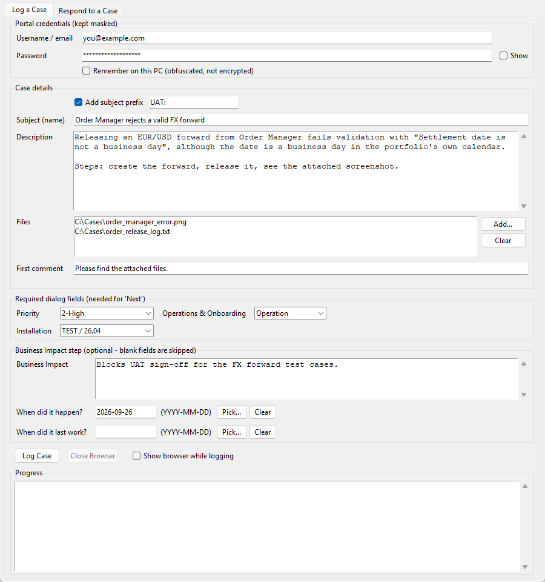
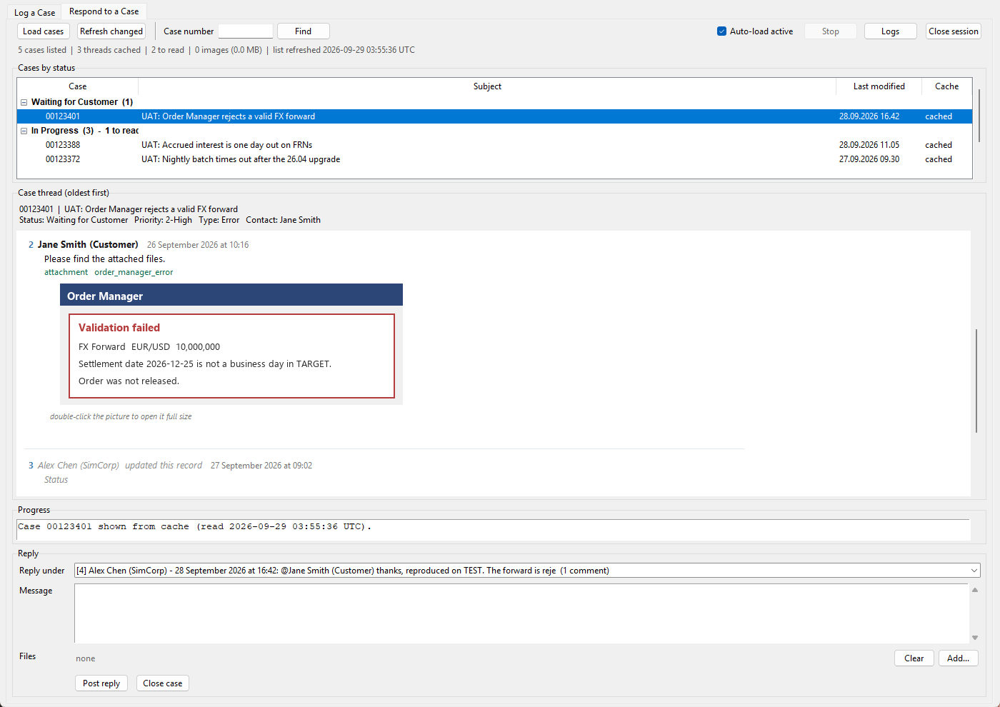

# Magpie

A Windows desktop app for SimCorp's support portal. Log a case, read the replies, answer them, without fighting the website.

SimCorp Dimension support runs on a Salesforce portal. Logging a case is a multi-step wizard, attaching files means one comment per file, and reading a thread means waiting for Lightning to render. Magpie does all of that from a small tkinter window, with Playwright driving a hidden Chromium.

It's not a SimCorp product and it isn't affiliated with or endorsed by SimCorp. It just uses the portal's web pages the same way you would.

| Log a Case | Respond to a Case |
| --- | --- |
|  |  |

*Both screenshots are the real window with made up data in it.*

## What it does

**Log a Case** fills in the `Dimension > Error` wizard: priority, operations and onboarding, installation, subject, description, the business impact step, and the project step that shows up when you pick Transition. It submits the case, uploads your files, then opens the new case and posts each file as a feed comment. You get one confirmation dialog, then it runs headless and reports each step as it goes, colour-coded.

**Respond to a Case** loads your case list and reads the active cases in the background, using a few browsers that share one login. Every thread gets cached in SQLite, so opening a case is instant. Threads show the way they do on the portal: rich text, @mentions, attachments under their post, and screenshots inline (double-click one to zoom). You can reply under any post, attach files and close a case. A cached thread only gets read again when the portal's `Last Modified Date` says it changed. An hourly check keeps the list fresh and a keep-alive stops the session dying overnight.

## Why it's built the way it is

Most of the decisions were forced by the portal.

* **Playwright, not Selenium.** Lightning renders inside shadow DOM and Playwright's locators can see into it. A plain `querySelectorAll` sees almost nothing.
* **One file per comment.** That's a Salesforce limit on Chatter comments, so several files means several comments. Replies with files go out as a case update instead, which allows ten.
* **Never click by coordinates.** The app runs at the real window size, and a button's `x` position was the first thing to break.
* **Walk the wizard, don't count it.** Picking Transition adds a step. So at each step it checks what's on screen instead of assuming there are two.
* **A SQLite cache.** Reading a thread from the portal takes about 20 s. From the cache it's 1 ms. The list view's `Last Modified Date` says exactly when a cached thread is out of date.
* **A pool of browsers, one login.** The cookies get exported once and every worker starts from them. Five cases take 50 s instead of over 200.
* **onedir, not onefile.** The machines it runs on use application whitelisting. A onefile exe unpacks itself to `%TEMP%` and gets blocked there.

[DEVELOPMENT_NOTES.md](DEVELOPMENT_NOTES.md) has the whole story in 26 sections: what I tried, what broke, and why it ended up like this. It's the most useful thing in here.

## What's where

| Module | What's in it |
| --- | --- |
| `sc_case_logger.py` | the Log a Case wizard automation, and it starts the app |
| `sc_gui.py` | the window |
| `sc_settings.py` | paths, stored settings, `CaseSubmission` |
| `sc_portal.py` | login, plus the shared waiting and locator fallback helpers |
| `sc_portal_session.py` | the long running headless browser behind the Respond tab |
| `sc_portal_pool.py` | several browsers sharing one login, for reading a backlog |
| `sc_case_reader.py` | reading a case thread, and replying to one post |
| `sc_case_cache.py` | the SQLite cache of the case list and the threads read |
| `sc_thread_view.py` | drawing a thread into the Tk text widget |
| `sc_image_viewer.py` | the zoomable screenshot window |

Settings and cache live next to the script or exe:

* `.sc_case_logger.json` holds your settings, and your login if you tick *Remember*. The login is obfuscated, **not** encrypted.
* `_cache\` holds the SQLite cache and downloaded screenshots. Safe to delete.
* `_screenshots\` holds diagnostic captures when `SCL_DEBUG_SHOTS=1`.

## Running it from source

Windows, Python 3.9 to 3.12. The exe is built with 3.12.

```
pip install -r requirements.txt
playwright install chromium
python sc_case_logger.py
```

The pins matter. Playwright 1.44 pins `greenlet 3.0.3`, which is the newest greenlet with prebuilt wheels for every Python from 3.9 to 3.12, so nothing needs a C compiler.

### Your own portal account

Two values in `sc_settings.py` are about your account, not the portal. Set them to whatever your portal shows.

* `TRANSITION_PROJECTS`: the projects offered when you pick **Transition**. Every customer account has its own. The ones in here are placeholders.
* `INSTALLATION_OPTIONS`: your installations and their Dimension version.

## Tests

```
pip install -r requirements-dev.txt
python -m pytest
```

37 tests. None of them touch the portal or need a browser installed. They cover the things that decide what gets sent to the portal (the date format it wants, the subject prefix, which project radio gets picked, case number input), settings that have to survive an upgrade (including files written by older builds), the colour of each progress line, and the real window, built and checked headless. CI runs them on Windows with Python 3.9 and 3.12.

The browser automation itself isn't unit tested, because every run creates a real case. The notes say how each step was checked against the live portal instead.

## Building the exe

```
build.bat
```

That makes `dist\SimCorp SF\`: the exe, a bundled Python and the Playwright driver. The target PC doesn't need Python or internet. Put a `browsers\` folder next to the exe (`build.bat` prints the command) and copy the whole folder across. If the target uses application whitelisting, build and run it from inside the whitelisted folder. Sections 11 and 14.6 of the notes explain why.

The exe is still called `SimCorp SF`. Renaming it would break pinned shortcuts on machines that already have it (section 23.1).

## Limits

* **Every Log a Case run creates a real case.** There's no dry run, just the one confirmation dialog.
* The selectors are tied to the portal's UI. If SimCorp redesigns it, things can break. Section 13 of the notes lists the fragile bits.
* The portal doesn't show a case's Description on the case page, so the Respond tab shows the conversation instead.
* Windows only. It's tkinter plus a PyInstaller Windows build.
* It isn't code-signed, so SmartScreen might warn you the first time.

## Licence

GPL-3.0. See [LICENSE](LICENSE).
